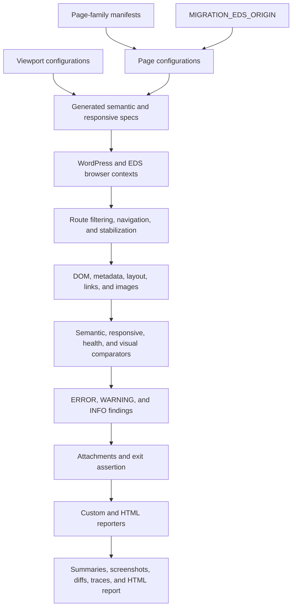
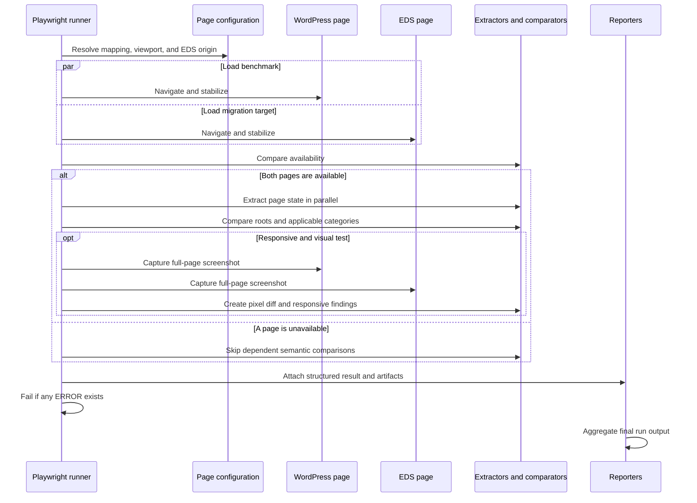

# Playwright migration validation guide

This Playwright suite compares the current public WordPress pages with their AEM Edge Delivery
Services (EDS) equivalents. WordPress is read at test time and remains the benchmark, so the suite
detects both initial migration gaps and later source-site changes without maintaining copied content
baselines.

The checks are read-only. They do not submit forms, create accounts, or trigger business workflows.
This document is the canonical usage and troubleshooting guide for developers and QA engineers.

## Contents

- [Quick start](#quick-start)
- [Live vs EDS comparison report](#live-vs-eds-comparison-report)
- [Comparison launcher UI](#comparison-launcher-ui)
- [Target an EDS environment](#target-an-eds-environment)
- [Test-case inventory](#test-case-inventory)
- [Architecture and execution flow](#architecture-and-execution-flow)
- [Run and filter tests](#run-and-filter-tests)
- [Debug failures](#debug-failures)
- [Reports and findings](#reports-and-findings)
- [Accept legitimate differences](#accept-legitimate-differences)
- [Add a page or page-specific override](#add-a-page-or-page-specific-override)
- [CI usage and expected runtime](#ci-usage-and-expected-runtime)
- [Troubleshooting](#troubleshooting)
- [Known limitations](#known-limitations)

## Quick start

Install project dependencies and the Chromium binary once:

```sh
npm install
npx playwright install chromium
```

Run the complete suite against the default EDS develop preview:

```sh
npm run test:migration
```

Run the fast, network-free unit suite:

```sh
npm run test:migration:unit
```

The unit suite still uses a local Chromium page for DOM-extraction tests, so Chromium must be
installed even though these tests do not request either public site.

Open the latest HTML report:

```sh
npm run test:migration:report
```

## Live vs EDS comparison report

The comparison report is a lighter, review-friendly alternative to the full migration suite. It
generates a standalone HTML report at `comparison-report/index.html` with:

- **Visual comparison** — live, EDS, and pixel-diff screenshots side by side, plus a visual
  difference percentage
- **Accessibility** — Lighthouse-style scores (0–100) for live and EDS
- **Performance** — Lighthouse-style speed scores (0–100) for live and EDS

Tests do not fail on differences; they always produce the report for review. This workflow is
intended for stakeholders who already use Lighthouse scores in DevTools.

### Run the report

Install dependencies and Chromium once (see [Quick start](#quick-start)), then:

```sh
npm run test:comparison
```

Open the generated report in your browser:

```sh
npm run test:comparison:open
```

On macOS this runs `open comparison-report/index.html`. You can also open that file directly in
Chrome, Safari, or Firefox.

### Comparison launcher UI

For reviewers who prefer not to use the terminal, start the local comparison launcher:

```sh
npm run comparison:ui
```

Then open `http://127.0.0.1:3456` in your browser. The launcher lets you:

- search and filter the configured page list
- select one or many pages with checkboxes
- choose the EDS preview origin and viewport
- run the comparison and watch progress in the activity log
- open the latest HTML report when the run finishes

The launcher runs locally on your machine and uses the same Playwright comparison workflow as
`npm run test:comparison`. Set a different port with `COMPARISON_UI_PORT=4000 npm run comparison:ui`
if needed.

### Choose which pages to test

**One page by name** — use Playwright `--grep` with part of the configured page name:

```sh
npm run test:comparison -- --grep "CMMS Software"
```

**A page family** — every page shares one or more tags:

```sh
npm run test:comparison -- --grep "@product"
npm run test:comparison -- --grep "@blog"
npm run test:comparison -- --grep "@case-studies"
npm run test:comparison -- --grep "@reviews"
npm run test:comparison -- --grep "@indexes"
```

**Specific pages by slug** — useful for scripts and the comparison launcher UI:

```sh
COMPARISON_SLUGS=product-cmms-software,blog-why-work-orders-matter npm run test:comparison
```

**First N pages** — useful for a quick sample across the manifest order:

```sh
COMPARISON_LIMIT=5 npm run test:comparison
```

**Skip then take** — pages 6–10 in manifest order (zero-based offset 5, limit 5):

```sh
COMPARISON_OFFSET=5 COMPARISON_LIMIT=5 npm run test:comparison
```

**Combine filters** — for example, the first three product pages only:

```sh
COMPARISON_LIMIT=3 npm run test:comparison -- --grep "@product"
```

List what would run without executing:

```sh
npx playwright test --config=playwright.comparison.config.js --reporter=line --list
```

### Viewport and environment options

| Variable | Default | Purpose |
| --- | --- | --- |
| `MIGRATION_EDS_ORIGIN` | `https://develop--fiixsoftware--adobedrago.aem.page` | EDS preview or live origin to compare (see [Target an EDS environment](#target-an-eds-environment)) |
| `COMPARISON_VIEWPORT` | `desktop` | `desktop`, `mobile`, or `tablet` screenshot and metrics viewport |
| `COMPARISON_LIMIT` | all pages | Maximum number of pages to test |
| `COMPARISON_OFFSET` | `0` | Skip the first N pages in manifest order |
| `COMPARISON_SLUGS` | all pages | Comma-separated page slugs to compare |
| `COMPARISON_WORKERS` | `2` | Parallel workers (`MIGRATION_WORKERS` is also accepted) |

**Default desktop report against develop preview:**

```sh
npm run test:comparison -- --grep "CMMS Software"
```

**Mobile viewport** — closer to DevTools Lighthouse mobile accessibility/performance defaults:

```sh
COMPARISON_VIEWPORT=mobile npm run test:comparison -- --grep "CMMS Software"
```

**Feature branch preview:**

```sh
MIGRATION_EDS_ORIGIN=https://my-feature--fiixsoftware--adobedrago.aem.page \
  npm run test:comparison -- --grep "CMMS Software"
```

**Local AEM dev server:**

```sh
MIGRATION_EDS_ORIGIN=http://localhost:3000 \
  npm run test:comparison -- --grep "CMMS Software"
```

**Main preview, one worker, five pages:**

```sh
MIGRATION_EDS_ORIGIN=https://main--fiixsoftware--adobedrago.aem.page \
  COMPARISON_LIMIT=5 \
  COMPARISON_WORKERS=1 \
  npm run test:comparison
```

Keep `COMPARISON_WORKERS` low when testing many pages; each page opens live and EDS in parallel.

### Report output

After a run, artifacts are written to:

```text
comparison-report/
  index.html          # side-by-side HTML report (open this)
  summary.json        # machine-readable results
  pages/<slug>/       # live.png, eds.png, diff.png per page
```

The summary table in `index.html` shows visual diff %, accessibility scores, and performance
scores for live vs EDS. Expand each page section for side-by-side screenshots and the same scores
in an easy-to-read layout. Scores use the same 0–100 scale as Lighthouse in Chrome DevTools.

If the EDS page returns **404**, **410**, or another error, that page is marked **Skipped** in the
report. Visual, accessibility, and performance checks are not run for unavailable EDS pages.

## Target an EDS environment

`MIGRATION_EDS_ORIGIN` selects the EDS origin for every configured page. If it is unset or empty,
the suite uses:

```text
https://develop--fiixsoftware--adobedrago.aem.page
```

The value must be an absolute HTTP(S) origin. A single trailing slash is accepted and normalized,
but paths, query strings, fragments, and credentials are rejected before test discovery.

Use the exact deployed feature-preview origin. The suite does not infer a branch name or rewrite
slashes and other branch-name characters:

```sh
MIGRATION_EDS_ORIGIN=https://my-feature--fiixsoftware--adobedrago.aem.page \
  npm run test:migration
```

Run a focused page against that feature preview:

```sh
MIGRATION_EDS_ORIGIN=https://my-feature--fiixsoftware--adobedrago.aem.page \
  npm run test:migration -- --grep "CMMS Software"
```

Target main preview, main live, or a local AEM proxy in the same way:

```sh
MIGRATION_EDS_ORIGIN=https://main--fiixsoftware--adobedrago.aem.page \
  npm run test:migration

MIGRATION_EDS_ORIGIN=https://main--fiixsoftware--adobedrago.aem.live \
  npm run test:migration

MIGRATION_EDS_ORIGIN=http://localhost:3000 \
  npm run test:migration -- --grep "CMMS Software"
```

The selected hostname is added to the configured equivalent internal hosts. Expected deployment-host
changes therefore do not become link or metadata destination failures when the logical path matches.

## Test-case inventory

There are 295 Playwright tests: 268 generated migration tests and 27 network-free unit tests. A
complete run writes 268 structured migration results because unit tests validate the framework
itself and do not emit page-comparison results.

### Generated page tests

| Test group | Count | Setup and behavior | Expected pass behavior | Findings and artifacts |
| --- | ---: | --- | --- | --- |
| Semantic migration | 67 | Opens WordPress and EDS at the desktop viewport, checks availability and content roots, then extracts and compares semantic content, links, images, metadata, pagination, and link health. | No `ERROR` findings; warnings and information remain reviewable. | One structured result and text attachment per page; traces retained on failure. |
| Mobile responsive and visual | 67 | Opens both pages at 375×812, checks visible content, navigation, images, overflow, alignment, pagination, page height, and pixels. | No major responsive loss or visual difference above the error threshold. | Live, EDS, and diff PNGs plus one structured result when capture succeeds. |
| Tablet responsive and visual | 67 | Repeats responsive and visual validation at 768×1024. | Same policy as mobile. | Tablet live, EDS, and diff PNGs plus one structured result. |
| Desktop responsive and visual | 67 | Repeats responsive and visual validation at 1440×900. | Same policy as mobile. | Desktop live, EDS, and diff PNGs plus one structured result. |

The 67 page mappings consist of six product pages, one reviews page, four index pages, 31 case
studies, and 25 blog posts.

### Framework unit tests

| Unit-test group | Count | Expected behavior |
| --- | ---: | --- |
| URL and text normalization | 3 | Equivalent WordPress/EDS URLs normalize equally, meaningful parameters remain sorted, and harmless typography/whitespace differences normalize consistently. |
| DOM extraction and pagination | 3 | Blockquotes, linked paragraphs, screen-reader exclusions, secondary links, and explicit pagination are extracted without duplicated semantic text. |
| Request routing | 1 | Audited analytics and third-party tracking hosts are blocked without blocking site assets. |
| Content comparison | 4 | Missing, unexpected, changed, duplicate-context, reordered, and threshold-edge content is classified consistently. |
| Link, redirect, and health comparison | 3 | Repeated links retain destinations, meaningful redirects are reported, and secondary links receive health checks. |
| Image comparison | 3 | Transformed image signals, match thresholds, incomplete lazy images, and broken images remain consistently classified. |
| Metadata and result policy | 2 | Metadata punctuation/domain changes and severity counts follow the documented exit policy. |
| Visual comparison | 1 | Shared-region pixel drift and page-height drift are scored independently while the diff retains the complete canvas. |
| Page mapping and environment configuration | 2 | All mappings are unique and valid; default, overridden, normalized, and invalid EDS origins behave as documented. |
| Case-study and blog manifest coverage | 2 | Static detail-page mappings stay aligned with repository listing snapshots. |
| Preserved source mapping | 1 | The supplied legacy `asset-catelog` path spelling remains covered. |
| Human-readable reporting | 2 | Page types appear in reports and repeated errors are grouped into concise failure summaries. |

## Architecture and execution flow

### Components



### Per-test sequence



## Run and filter tests

Use `--grep` to focus a page name:

```sh
npm run test:migration -- --grep "Resource Center Ebook"
```

Every page also has one or more page-family tags:

```sh
npm run test:migration -- --grep "@case-studies"
npm run test:migration -- --grep "@blog"
npm run test:migration -- --grep "@product"
npm run test:migration -- --grep "@reviews"
npm run test:migration -- --grep "@indexes"
```

Playwright applies `--grep` to the complete title, including the describe block and tags. Prefer an
unanchored page name or tag unless the full generated title is known.

Set `MIGRATION_WORKERS` to change the default concurrency of two fully parallel workers:

```sh
MIGRATION_WORKERS=1 npm run test:migration -- --grep "CMMS Software"
```

Keep concurrency low to avoid unnecessary load on both public sites. List discovered tests without
executing them:

```sh
npx playwright test --config=playwright.migration.config.js --reporter=line --list
```

## Debug failures

Start with one page and one worker so logs and artifacts are deterministic:

```sh
MIGRATION_WORKERS=1 npm run test:migration -- --grep "CMMS Software"
```

Watch Chromium while the test runs:

```sh
npm run test:migration -- --grep "CMMS Software" --headed --workers=1
```

Open Playwright Inspector, pause before actions, and step through the focused test:

```sh
npm run test:migration -- --grep "CMMS Software" --debug
```

The configuration retains a trace for failed tests. Play a trace using the path printed in the
failure output:

```sh
npx playwright show-trace path/to/trace.zip
```

Use the HTML report to inspect steps, attachments, errors, and traces together:

```sh
npm run test:migration:report
```

For visual failures, inspect `live.png`, `eds.png`, and `diff.png` together. For semantic failures,
open the `migration-error-summary` attachment first, then use `migration-summary` for all warning
and informational details.

## Reports and findings

The HTML report is written to `playwright-report/migration/`. Machine-readable and text summaries
are written to:

```text
test-results/migration/summary.json
test-results/migration/summary.txt
```

Responsive artifacts use this structure:

```text
test-results/migration/<page>/<viewport>/
  live.png
  eds.png
  diff.png
```

A complete run can produce 603 live/EDS/diff PNG artifacts. Failed Playwright tests may also write
traces and error context beneath `test-results/playwright/`.

### Severity and exit policy

- `ERROR`: a meaningful migration issue, such as unavailable EDS content, missing copy, changed
  CTA, broken link, missing metadata, major responsive loss, or major visual difference. Any error
  fails the test.
- `WARNING`: requires human review but may be an accepted implementation difference, such as
  heading-level drift, uncertain image equivalence, inaccessible third-party link, or moderate
  visual difference. Warnings do not fail the test.
- `INFO`: an expected or harmless observation, such as equivalent internal hosts, an extra global
  link, or a visual difference below the warning threshold.

The suite accumulates findings before asserting. Failed tests show a grouped bullet summary in the
Playwright error panel, while complete details remain in the `migration-summary` attachment and
run-level summaries.

### What is compared

- Semantic content: headings, paragraphs, blockquotes/testimonial attributions, lists, labels,
  captions, buttons, cards, and order.
- Links: visible content and global links, CTA destinations, redirects, and response health.
- Images: load state, source variants, alt text, context, dimensions, aspect ratio, and matching.
- Metadata: title, description, canonical, Open Graph, and present Twitter fields.
- Responsive behavior: mobile, tablet, and desktop visibility, overflow, navigation affordances,
  images, and major alignment drift.
- Visual fidelity: stabilized full-page WordPress, EDS, and pixel-diff screenshots.

Primary comparisons use configured content roots so header/footer implementation details do not
overwhelm the report. Global links are still recorded at lower default severity. Social-share labels
and lists are excluded from primary content; secondary policy links remain health-checked.

### URL and visual normalization

Configured Fiix, AEM preview, AEM live, and the selected EDS host are treated as one internal site.
Normalization also handles relative URLs, trailing slashes, query-parameter ordering, optional
hashes, and known tracking parameters. All other query parameters are preserved.

Visual capture waits for fonts, authored lazy images, and stable page height; disables motion;
blocks audited analytics, chat, survey, and consent requests; and hides configured overlays. The
default pixel color-distance threshold is `0.15`. Shared-region pixel differences above 2% are
warnings and above 20% are errors. Page-height differences are scored separately using the same
warning and error ratios.

## Accept legitimate differences

Do not suppress a finding simply to make a migration run pass. First reproduce it with one worker,
inspect both pages and artifacts, and confirm that the difference is intentional and does not remove
meaning, accessibility, navigation, or functionality.

Use the narrowest supported mechanism:

| Difference | Supported mechanism | Acceptance requirement |
| --- | --- | --- |
| Consent, chat, survey, or other non-product overlay | Add a page-specific `maskSelectors` entry. | Selector must target only the dynamic overlay. |
| Implementation-only or duplicated non-visible text | Add a page-specific `excludeSelectors` entry. | Confirm meaningful and screen-reader content remains covered. |
| Intentional dynamic visual region | Add a page-specific mask. | Verify semantic extraction still validates the region's meaningful text and links. |
| Approved visual variance | Add a page-specific `visualThresholds` override. | Use measured values and the smallest increase that represents the accepted design. |
| Meaningful source/EDS content difference | Align the pages or track an explicit comparator enhancement. | Do not hide it with a broad selector or global threshold. |

Place every exception next to the page configuration with a comment containing:

- the reason the difference is legitimate;
- a ticket or decision reference;
- the approving owner/team;
- the review or expiry date when temporary.

Create page-specific arrays and objects instead of mutating the shared defaults. For example:

```js
const base = pageConfig(name, path, pageType, tags);
return {
  ...base,
  // DRAGO-000: approved survey overlay; Web Platform; review 2026-12-01.
  maskSelectors: [...base.maskSelectors, '.page-specific-survey'],
  visualThresholds: {
    ...base.visualThresholds,
    warning: 0.03,
  },
};
```

Global defaults may change only when the same intentional behavior applies to every configured page
and the change has been reviewed. There is currently no structured allowlist for accepting an
individual semantic finding by code and value.

## Add a page or page-specific override

The suite contains explicit mappings in `config/page-families.js`; `config/pages.js` turns them into
complete configurations. Test logic is generated from configuration, so no spec duplication is
required.

```js
const productPages = [
  // Display name, shared path on the WordPress and EDS hosts.
  ['Example Page', '/example'],
];
```

After adding a page:

1. Run `npm run test:migration:unit` to validate uniqueness, paths, tags, and manifest alignment.
2. List or grep the generated semantic and three viewport tests.
3. Run the page with one worker and review every first-run finding.
4. Add only justified, page-specific exceptions following the acceptance process above.

For index pages, the suite performs a controlled scroll sweep to trigger viewport-driven content.
If the source exposes explicit pagination, it adds `SOURCE_PAGINATION_DETECTED`. The rendered page is
still compared as visitors see it, while supplied detail-page manifests remain the authoritative
migration scope.

## CI usage and expected runtime

### Push validation

The standard build workflow installs Chromium and runs `npm run test:migration:unit` after linting.
This validates framework logic and configuration without requesting either public site.

### Manual full validation

In GitHub Actions, open **Migration validation**, choose **Run workflow**, and provide:

- `eds_origin`: the exact EDS origin, with no page path;
- `test_filter`: an optional Playwright grep expression such as `@product` or `CMMS Software`;
- `workers`: one to four, defaulting to two.

The job has a 90-minute timeout. It uploads the HTML report, run summaries, screenshots, diffs,
traces, and error contexts for 14 days even when tests fail. Full validation remains manual because
it depends on mutable public sites, generates substantial traffic, and is intentionally reviewed by
a human.

### Runtime estimates

| Run | Expected runtime | Notes |
| --- | --- | --- |
| Unit suite | Approximately 2–5 seconds | Excludes dependency and Chromium installation time. |
| One page across semantic and three viewports | Approximately 30–90 seconds | Link count, page height, image loading, and network latency have large effects. |
| Complete suite with two workers | Approximately 20–45 minutes | Network-dependent estimate, not a service-level guarantee. Retries can increase CI duration. |

Keep the default two workers unless a focused diagnostic requires one. Increase workers only after
considering load on both sites.

## Troubleshooting

### Common failure example

```text
Migration error summary — Example Page [desktop semantic]

- [CONTENT/MISSING_CONTENT] Missing paragraph in EDS: "Important source copy"
- [LINKS/BROKEN_LINK] EDS link returned HTTP 404: "Start now"

2 warning(s) and 1 info finding(s) are available in the migration-summary attachment.
```

This means the test failed because it contains at least one `ERROR`. Inspect the complete summary to
avoid fixing only the first representative item from a grouped category.

| Symptom or finding | Likely cause | What to do |
| --- | --- | --- |
| `Executable doesn't exist` or browser launch failure | Chromium has not been installed for the current Playwright version. | Run `npx playwright install chromium`; in Linux CI use `npx playwright install --with-deps chromium`. |
| `No tests found` | The grep expression does not match the complete generated title, often because it is over-anchored. | Run the documented `--reporter=line --list` command, then use an unanchored page name or family tag. |
| Invalid `MIGRATION_EDS_ORIGIN` before discovery | The value contains a path, query, fragment, credentials, or unsupported scheme. | Pass only an exact HTTP(S) origin, for example `https://feature--repo--owner.aem.page`. |
| `LIVE_PAGE_UNAVAILABLE` or `EDS_PAGE_UNAVAILABLE` | DNS, deployment, timeout, redirect, or non-success navigation response. | Open the final URL, verify preview publication, rerun one page, and inspect the retained trace. |
| `LIVE_CONTENT_ROOT_MISSING` or `EDS_CONTENT_ROOT_MISSING` | Configured root no longer matches the rendered DOM. | Inspect delivered markup and update only the affected root configuration; do not exclude the page. |
| `MISSING_CONTENT`, `UNEXPECTED_CONTENT`, or `CHANGED_CONTENT` | Copy is absent, added, changed, hidden, or extracted under a different semantic element. | Compare visible and accessibility text, then align content or document a legitimate implementation-only exclusion. |
| `MISSING_LINK` or `LINK_DESTINATION_CHANGED` | CTA/link is absent, destination changed, or matching context differs. | Compare label, normalized URL, scope, and context; also see the known link-context limitation. |
| `BROKEN_LINK` | A content or secondary destination returned HTTP 404 or 410. | Verify with a normal GET, correct the destination, and republish if necessary. |
| `LINK_UNVERIFIABLE` | Authentication, rate limiting, timeout, or transient server failure prevented classification. | Retry the focused page; review persistent third-party warnings manually. |
| `MISSING_IMAGE`, `BROKEN_EDS_IMAGE`, or incomplete-load warning | Image is absent, failed, still lazy, or did not meet semantic match signals. | Inspect rendered media and requests; also check the transformed-image limitation below. |
| `HORIZONTAL_OVERFLOW` or missing navigation | EDS layout exceeds the viewport or no visible navigation/menu affordance was detected. | Reproduce headed at the reported viewport and inspect computed layout. |
| `VISUAL_DIFFERENCE` or `PAGE_HEIGHT_DIFFERENCE` | Layout, content, fonts, dynamic regions, or load timing differ. | Compare all three PNGs, use one worker, and add only narrowly justified masks/thresholds. |
| Test timeout | Navigation, images, link health, or page stabilization exceeded the four-minute test timeout. | Retry one page, inspect trace/request failures, and confirm the target is responsive before changing timeouts. |
| Playwright fails but the run summary omits the page | An infrastructure error occurred before the structured result attachment. | Use the HTML report and trace; this is a known reporter limitation. |
| Duplicate page result in CI summary | A failed test was retried and each attempt was collected. | Use Playwright's final test status and inspect the retry entries; this is a known reporter limitation. |

## Known limitations

These limitations are intentionally documented here and are not fixed by the operational-support
change:

1. **Link context participates in identity.** A preserved label and destination can be reported as
   missing plus unexpected when its surrounding heading context changes. Context should eventually
   become a tie-breaker instead of a required identity field.
2. **Some equivalent transformed images do not reach the match threshold.** Exact alt text and a
   compatible aspect ratio score below the threshold when AEM replaces the filename and context is
   absent or structurally different.
3. **The custom reporter records retry attempts.** CI retries can create duplicate structured results;
   a flaky test that later passes can leave an earlier error-bearing entry in the summary.
4. **Infrastructure failures can be absent from run summaries.** Errors before `migration-result` is
   attached still fail Playwright but may omit the affected page from custom JSON/text summaries.
5. **URL normalization discards protocol.** HTTP and HTTPS URLs with the same host and path currently
   compare as equivalent, potentially hiding a protocol downgrade.
6. **Image order is not validated.** Image matching uses an availability set and does not report a
   reorder of otherwise equivalent images.
7. **The WordPress benchmark is mutable.** Source edits, experiments, third-party behavior, and outages
   can change results without a repository change.
8. **Coverage is read-only.** The suite does not submit forms, authenticate, create records, or validate
   downstream business workflows.
9. **There is no structured semantic-finding allowlist.** Legitimate semantic differences require
   page alignment, a narrow implementation-only exclusion, or a future comparator enhancement.

Treat the run as migration evidence, not as a substitute for accessibility, functional, performance,
or human visual QA.
